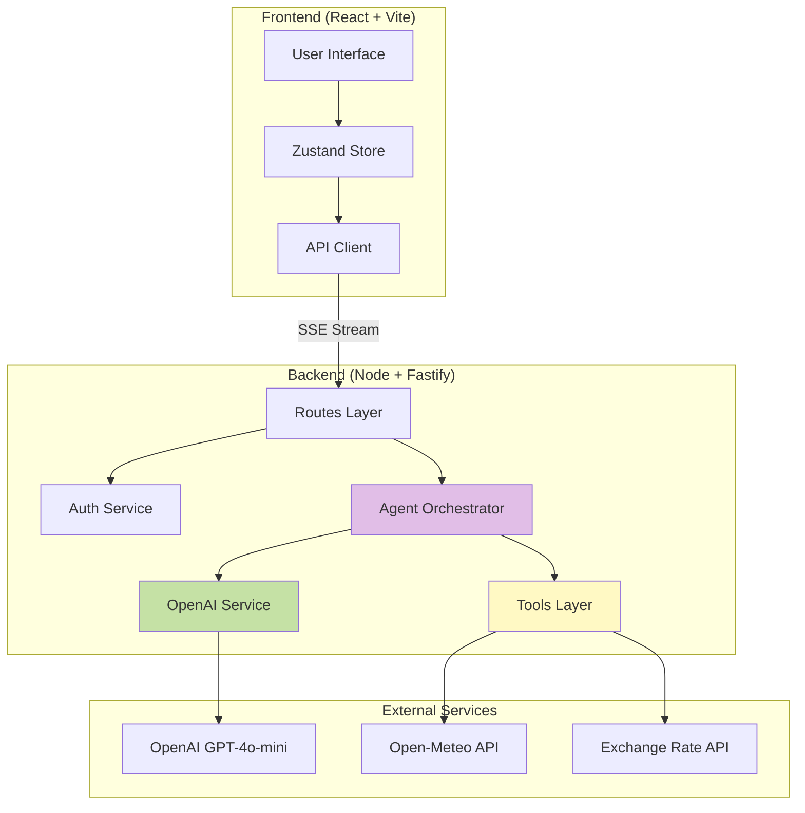
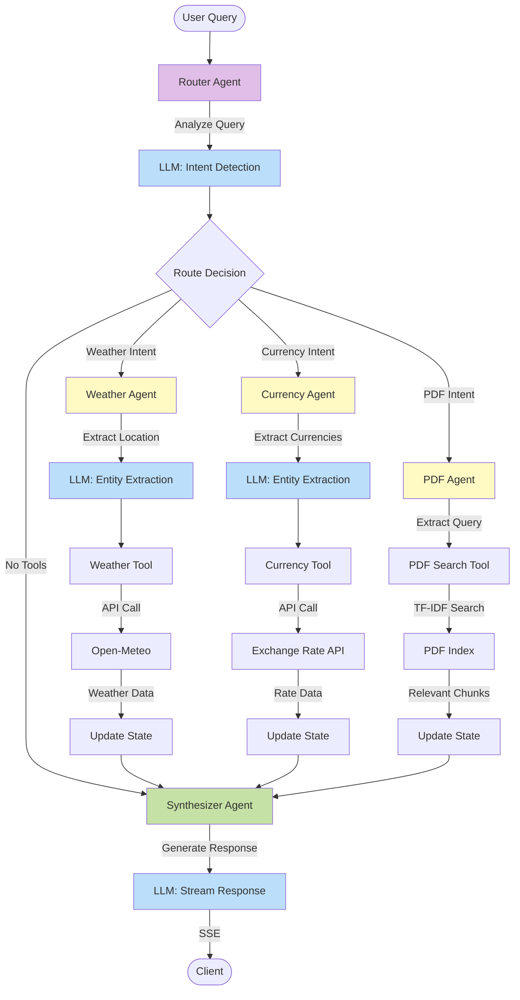
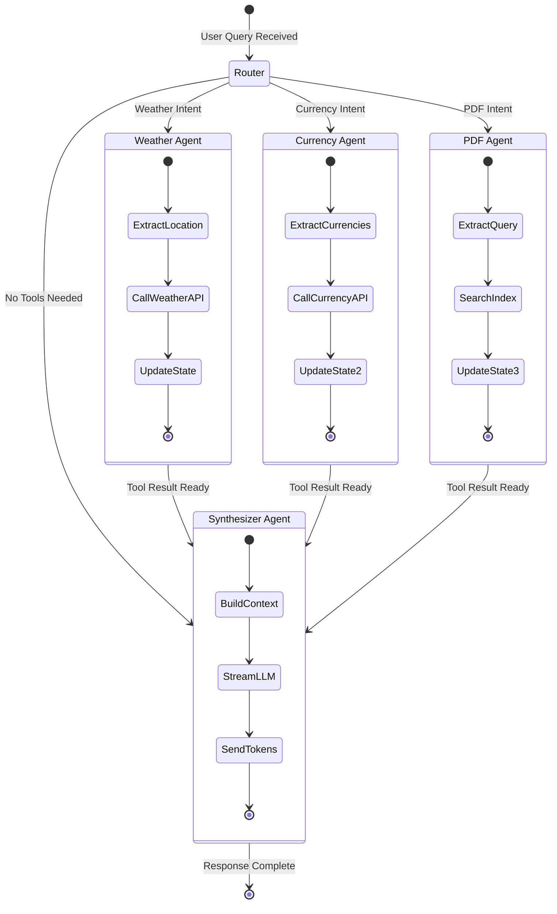
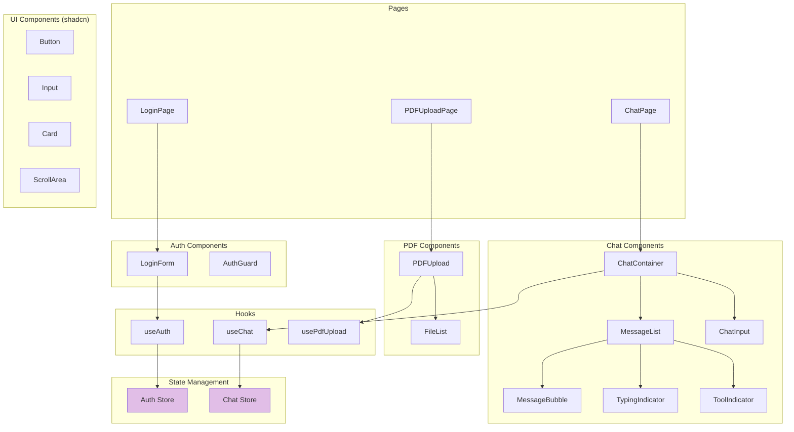
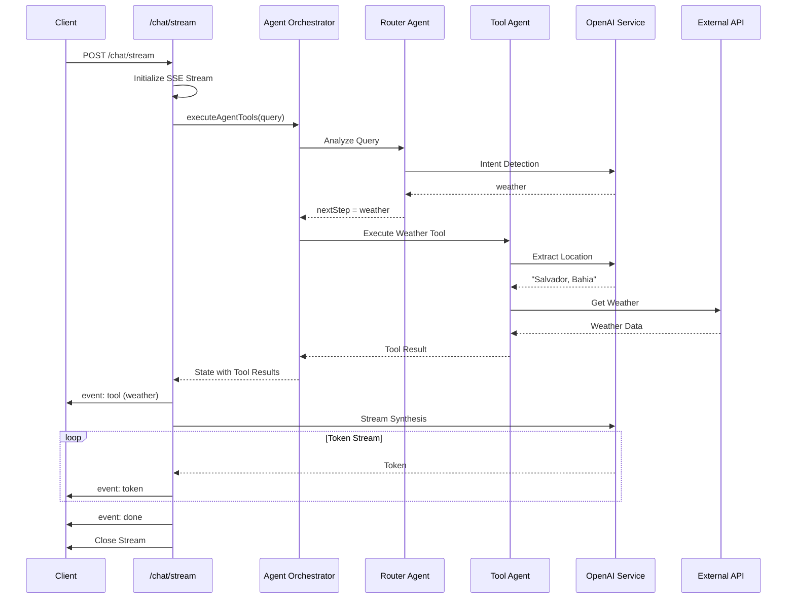
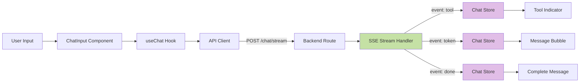
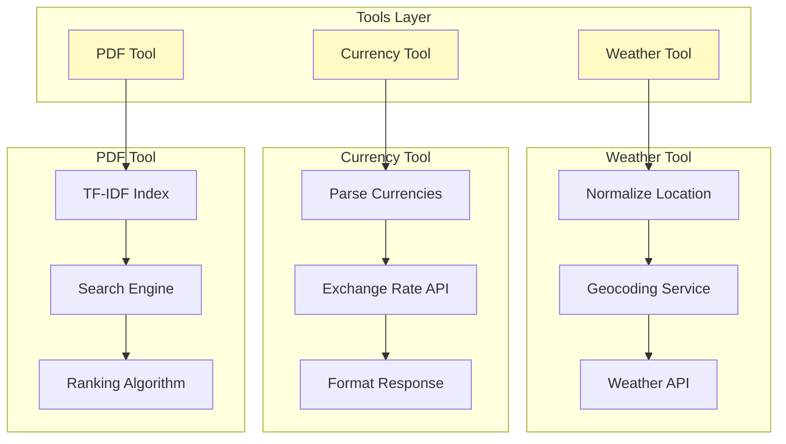
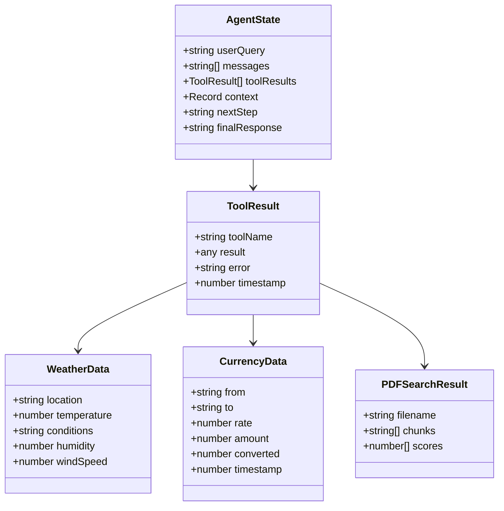
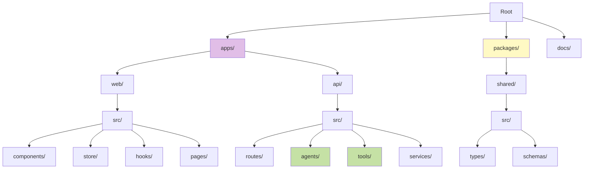
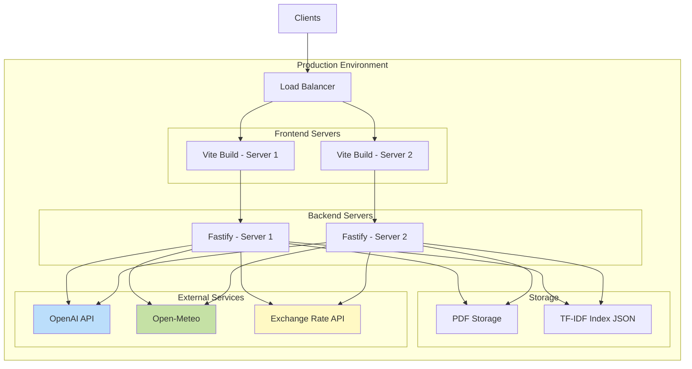

# Architecture Diagrams

## 1. System Overview

## 2. Agent Architecture (Core Focus)

## 3. Agent State Flow

## 4. Frontend Component Architecture

## 5. Backend Request Flow (SSE Streaming)

## 6. Data Flow (Message Streaming)

## 7. Tools Architecture

## 8. Agent State Structure

## 9. Monorepo Structure

## 10. Deployment Architecture

---

## Key Architectural Decisions

### 1. **Agent Orchestration**
- **Custom implementation** instead of LangGraph (removed due to version incompatibility)
- **Stateful agents** with explicit state transitions
- **LLM-based routing** for flexible intent detection (not keyword-based)

### 2. **Streaming Architecture**
- **Server-Sent Events (SSE)** for real-time token delivery
- **Progressive response**: tool notifications → token stream → completion
- **State synchronization** between backend agents and frontend store

### 3. **Tool Design**
- **Autonomous tools**: Each tool is self-contained with its own logic
- **Geocoding intelligence**: Smart location resolution with Brazilian context awareness
- **Currency formatting**: Market-standard precision (4 decimals for rates, 2 for amounts)

### 4. **Frontend Patterns**
- **Component composition**: Atomic design principles
- **State management**: Zustand for simplicity vs Redux complexity
- **Optimistic UI**: Show typing indicators and tool usage immediately

### 5. **Scalability**
- **Monorepo**: Shared types and utilities across frontend/backend
- **Modular agents**: Easy to add new agents/tools
- **Stateless design**: Backend can scale horizontally
- **Persistent storage**: TF-IDF index saved to disk for persistence

---

## Diagrams Explanation

1. **System Overview**: High-level view of frontend, backend, and external services
2. **Agent Architecture**: Core focus - detailed agent orchestration flow
3. **Agent State Flow**: State machine showing agent transitions
4. **Frontend Component Architecture**: React component hierarchy
5. **Backend Request Flow**: Sequence diagram showing SSE streaming
6. **Data Flow**: Message streaming from user to UI
7. **Tools Architecture**: Internal structure of each tool
8. **Agent State Structure**: TypeScript classes and interfaces
9. **Monorepo Structure**: Project organization
10. **Deployment Architecture**: Production setup (optional)
